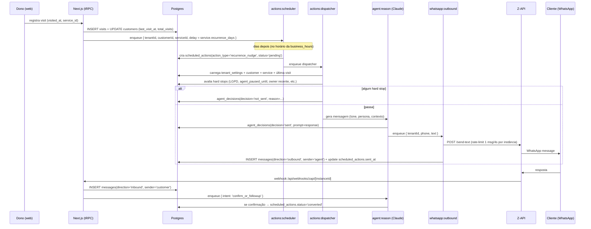

# Arquitetura — RECORRENTE

## Visão geral

```mermaid
flowchart LR
  WAZapi([WhatsApp do cliente]) -- mensagem --> ZAPI[(Z-API)]
  ZAPI -- webhook --> Web[/Next.js<br/>/api/webhooks/zapi/[instanceId]/]
  Web -- enfileira --> QIN[(whatsapp:inbound)]

  subgraph Worker (processo separado)
    QIN --> WIN[whatsapp:inbound<br/>processor]
    WIN -- classifica/grava --> DB[(Postgres)]
    WIN -- agenda --> QREASON[(agent:reason)]
    QREASON --> WREASON[agent:reason<br/>Claude Sonnet/Haiku]
    WREASON -- mensagem aprovada --> QOUT[(whatsapp:outbound)]
    QOUT --> WOUT[whatsapp:outbound<br/>rate-limited]
    WOUT -- send-text --> ZAPI

    CRON[cron diário<br/>actions:scheduler] --> DB
    CRON -- enfileira --> QDISP[(actions:dispatcher)]
    QDISP --> WDISP[actions:dispatcher]
    WDISP --> QREASON
  end

  Web -. tRPC .-> DB
  Owner([Dono do negócio]) -. browser .-> Web
```

---

## Fluxo end-to-end de uma recorrência (Pilar 1)



---

## Multi-tenant — invariante de isolamento

```mermaid
flowchart TD
  Req([Request]) --> Auth{Tem session<br/>cookie?}
  Auth -- não --> R401[/401/]
  Auth -- sim --> Ctx[createContext]
  Ctx --> Link{session.tenantId<br/>vinculado em<br/>user_tenants?}
  Link -- não --> CtxNull[ctx.tenant = null]
  Link -- sim --> CtxFull[ctx.tenant = { userId, tenantId, role }]
  CtxFull --> TP{procedure type}
  CtxNull --> TP
  TP -- public --> OK1[ok]
  TP -- protected --> ChkSess{session?}
  ChkSess -- não --> R401
  ChkSess -- sim --> OK2[ok]
  TP -- tenantRead/tenantWrite --> ChkTen{ctx.tenant?}
  ChkTen -- não --> R403[/403/]
  ChkTen -- sim --> Wrap[tenantDb tenantId]
  Wrap --> Q[query Drizzle<br/>com tenant_id filtrado]
```

**Regras práticas:**
- Procedure `publicProcedure`: login, signup, webhooks (que validam por token próprio).
- Procedure `protectedProcedure`: usuário autenticado sem escopo de tenant (ex.: `tenant.list` para escolher).
- Procedure `tenantReadProcedure`: leitura escopada.
- Procedure `tenantWriteProcedure`: escrita escopada — operadores não escrevem.
- **Nunca** importar `db` direto em router de tenant. Use `tenantDb(ctx.tenant.tenantId)`.

---

## Fluxo do webhook Z-API

1. Z-API faz `POST /api/webhooks/zapi/{instanceId}` com header `Client-Token`.
2. Endpoint busca `tenants` por `zapi_instance_id = instanceId`.
3. Se não acha tenant → 404. Se acha e token bate → segue. Se não bate → 401.
4. Se `tenant.status != 'active'` → 200 com `dropped: true` (não enfileira).
5. Caso contrário enfileira em `whatsapp:inbound` com `jobId` deterministico
   (`tenantId:zapiMessageId`) para idempotência.
6. Worker `whatsapp:inbound` processa: grava `messages`, decide se chama agente,
   trata opt-out, etc.

---

## Filas BullMQ

| Fila                     | Quem produz                  | Quem consome              |
|--------------------------|------------------------------|---------------------------|
| `whatsapp:inbound`       | webhook Z-API                | worker inbound            |
| `whatsapp:outbound`      | worker agent:reason          | worker outbound (1msg/4s) |
| `actions:scheduler`      | cron diário (9h timezone)    | worker scheduler          |
| `actions:dispatcher`     | scheduler + jobs delayed     | worker dispatcher         |
| `agent:reason`           | dispatcher + inbound         | worker LLM                |
| `metrics:rollup`         | cron diário                  | worker rollup             |

**Nesta fase fundacional:** todas as 6 filas existem e workers rodam stubs que
apenas logam o job. Lógica real entra nos prompts subsequentes (1 por pilar).

---

## LGPD — pontos de cumprimento

| Onde                     | O quê                                                      |
|--------------------------|------------------------------------------------------------|
| primeira outbound        | rodapé com "responda SAIR para parar"                      |
| inbound parser           | keywords SAIR/PARAR/REMOVER/CANCELAR/STOP → opt-out + ack  |
| `customers.lgpd_opted_out_at` | bloqueia toda outbound (hard stop §7.1)              |
| `tenant_settings.lgpd_data_controller_email` | exibido em templates de primeiro contato |
| `agent_decisions`        | retenção 90 dias via job de purge                          |
| `/api/lgpd/request-deletion` | exclusão verificada por código WhatsApp (a implementar) |
